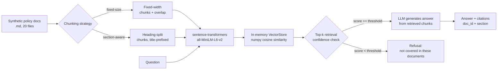

# Insurance Document RAG

> **Educational reconstruction.** This repository rebuilds the architecture of a document question-answering system over insurance policy documents using synthetic policy documents generated by the script in this repo. It is not the original source code and contains no employer data.

## Executive Summary

Built a retrieval-augmented question-answering pipeline over a synthetic corpus of 20 health insurance policy documents, spanning four cover tiers (Bronze/Silver/Gold/Platinum) and five customer variants (Individual/Family/Senior/Expatriate/Student). The pipeline chunks documents, embeds chunks locally with `sentence-transformers`, retrieves via in-memory cosine similarity, and answers with citations back to the source document and section — refusing to answer when retrieval confidence is too low to trust. Two chunking strategies were implemented and evaluated head-to-head on a hand-built gold question set: section-aware chunking reached a **1.000 hit rate / 1.000 MRR** against fixed-size chunking's **0.867 / 0.767**, and also cleanly separated answerable from unanswerable questions at a single confidence threshold where fixed-size chunking could not. All numbers below come from an actual run of the code in this repo, captured in this environment on 2026-08-14.

## Business Problem

Policy documents are long, formulaic, and full of numbers that matter (waiting periods, claim limits, exclusion clauses) buried in prose. A customer or claims handler asking "what's my maternity waiting period" needs the exact figure from the exact policy they hold, not a plausible-sounding average across every tier. Two failure modes make this genuinely hard: retrieving the wrong document's fact (a Bronze customer told a Platinum figure), and the system inventing an answer when the true answer is that the corpus simply doesn't cover that benefit. Both are addressed directly here rather than assumed away.

## Why It Matters

In insurance, an answer without a traceable source is a liability, not a feature — a claims team cannot act on an LLM's confident-sounding paraphrase without knowing which policy clause it came from. A system that (a) always cites the specific document and section behind an answer, and (b) explicitly refuses when it isn't confident it found the right source, is what makes generative AI usable in a regulated, evidence-driven domain instead of just impressive in a demo.

## Architecture



## Dataset

20 synthetic Markdown policy documents (`data/policies/`), generated by `src/generate_documents.py` from a deterministic lookup table — not free-text templates — so every fact in the gold evaluation set traces unambiguously to one document. Each document covers a `{Bronze, Silver, Gold, Platinum} x {Individual, Family, Senior, Expatriate, Student}` combination and has five structured sections: **Cover Levels**, **Exclusions**, **Waiting Periods**, **Claims Procedure**, and **Geographic Scope**, plus an **Additional Terms** section carrying variant-specific clauses (dependant age limits, evacuation cover, academic-year term limits, and so on). No employer data, real policy wording, or real insurer is involved.

## Methodology

1. **Generate** the 20-document corpus (`src/generate_documents.py`).
2. **Chunk** every document two ways: `fixed_size_chunks` (400-char windows, 80-char overlap, structure-blind) and `section_aware_chunks` (split on `## ` headings, each chunk prefixed with the document's title line, oversized sections fall back to fixed windows).
3. **Embed** every chunk locally with `all-MiniLM-L6-v2` (`src/embeddings.py`) and load into an in-memory `VectorStore` (`src/vector_store.py`) — a single numpy matrix, cosine similarity via one matrix multiply.
4. **Retrieve** top-k chunks for a question by cosine similarity.
5. **Guard**: if the best retrieved similarity score is below `DEFAULT_CONFIDENCE_THRESHOLD`, refuse before calling any LLM.
6. **Generate**: otherwise, build a prompt from the retrieved chunks and call an LLM (`ScriptedLLM` in tests/eval; `OpenAILLM` optionally, live, if `OPENAI_API_KEY` is set) — the answer carries citations to `(doc_id, chunk_id, section)`.
7. **Evaluate**: run both chunking strategies through the 18-question gold set (`eval/questions.yaml`) and compute hit rate and MRR for the 15 answerable questions, and refusal accuracy for the 3 unanswerable ones (`src/run_eval.py`).

## Model / Approach

- **Embeddings**: `sentence-transformers/all-MiniLM-L6-v2`, run locally on CPU. No hosted embedding API is called at any point.
- **Vector store**: a plain Python class wrapping one numpy array (`src/vector_store.py`), L2-normalised embeddings, cosine similarity by dot product, `np.argsort` for top-k. No vector database.
- **Answer generation**: an `LLMClient` protocol with two implementations — `ScriptedLLM`, a queued-response test double used throughout tests and the eval demo, and an optional `OpenAILLM` for live use with a real API key (not exercised in this environment; see Results).
- **Hallucination guard**: a retrieval-confidence threshold checked in code *before* the LLM is invoked (`src/qa.py::answer_question`), not a prompt instruction the LLM might ignore.

## Results

All numbers below are from an actual run of `python -m src.run_eval` and `pytest -v` in this repo (`.venv`, Python 3.11.9, sentence-transformers 2.7.0, torch 2.13.0 CPU), captured 2026-08-14.

### Chunking-strategy comparison (retrieval quality, top-5, 15 answerable questions)

| Strategy | Chunks produced | Hit rate | MRR |
|---|---|---|---|
| Fixed-size (400 chars, 80 overlap) | 119 | 0.867 | 0.767 |
| Section-aware (heading split, title-prefixed) | 120 | **1.000** | **1.000** |

Section-aware chunking wins outright on this corpus and question set — not a marginal difference. The reason surfaced during development, not by assumption: an early version of section-aware chunking split off the document's title/policy-code preamble into its own chunk. That regressed hit rate to 0.533 / MRR to 0.302, *worse* than fixed-size, because the title line ("# Gold Family Health Policy") is the strongest lexical signal tying a chunk to the tier/variant a question asks about, and isolating it let boilerplate-only chunks from the wrong document out-rank real content. Prefixing every section chunk with its document's title line (current implementation) fixed this and produced the 1.000/1.000 result above. This is reported because a chunking change that looks obviously correct (respect document structure) made retrieval *worse* until the title-handling detail was fixed — the numbers, not intuition, caught it.

### Hallucination-guard test (confidence threshold = 0.6, same threshold for both strategies)

| Strategy | Unanswerable Qs correctly refused | Answerable Qs incorrectly refused (false refusals) |
|---|---|---|
| Fixed-size | 3/3 | 8/15 |
| Section-aware | 3/3 | **0/15** |

At a threshold strict enough to catch every genuinely unanswerable question, fixed-size chunking's similarity scores for real answers overlap so much with its scores for irrelevant matches that a single threshold also wrongly refuses over half the legitimate questions. Section-aware chunking's answerable-question scores (0.688–0.841) and unanswerable-question scores (0.449–0.531) don't overlap at all in this run, so one threshold gets full hallucination coverage with zero collateral refusals. This is a second, independent way section-aware chunking outperforms fixed-size here, beyond raw hit rate.

### Hallucination-guard unit test

`tests/test_qa.py::test_unanswerable_question_triggers_refusal_without_calling_llm` passes: it constructs a `ScriptedLLM` with an **empty response queue**, so if the confidence guard failed to short-circuit and the code called the LLM anyway, the test would fail on `AssertionError: ScriptedLLM called with no queued responses left` rather than silently accepting a hallucinated answer. It passes — the guard triggers correctly with zero LLM calls (`llm.calls == []`).

### Test suite and lint

```
16 passed in 0.16s
```
```
All checks passed!
```
(`pytest -v` and `ruff check .`, run against the full `src/` and `tests/` tree, no network, no API key.)

### Live-LLM answer quality — explicitly unmeasured

No `OPENAI_API_KEY` is available in this environment, so **no live-LLM answer-quality percentage is claimed anywhere in this README**. `OpenAILLM` (`src/llm.py`) is implemented and would slot into `answer_question` unchanged, but it has not been run against a real API key here. Everything reported above — hit rate, MRR, and the hallucination-guard results — is retrieval-only and needs no LLM, which is why it can be measured honestly in this environment.

## Business Interpretation

A 1.000 hit rate at top-5 on section-aware chunking means, on this gold set, the correct source document was always in the short list an LLM would be shown — the generation step's job becomes strictly "read the given excerpt correctly," not "guess where the answer might be." Zero false refusals at a threshold that still catches every genuinely unanswerable question means the guard doesn't cost usability to buy safety, on this corpus and question set. The fixed-size numbers are the honest counterfactual: a naive chunking choice would still work "well enough" on hit rate (0.867) but would make the hallucination guard nearly unusable (53% of legitimate questions wrongly refused at the threshold needed for full safety coverage) — the kind of failure that would not show up in a hit-rate metric alone.

## How to Run

```bash
git clone <this-repo>
cd insurance-document-rag
python -m venv .venv
.venv\Scripts\activate            # Windows; use `source .venv/bin/activate` on macOS/Linux
pip install -r requirements.txt   # first run downloads all-MiniLM-L6-v2 (~90MB), fully offline after that

python -m src.generate_documents  # writes 20 synthetic policy docs to data/policies/
python -m src.run_eval            # real hit-rate/MRR + hallucination-guard numbers, both strategies

pytest -v                         # 16 tests, no network, no API key required
ruff check .                      # lint
```

Optional live-LLM step: copy `.env.example` to `.env`, set `OPENAI_API_KEY`, and use `src.llm.OpenAILLM` in place of `ScriptedLLM` when calling `answer_question`. Not required for retrieval, evaluation, or tests.

## Project Structure

```
insurance-document-rag/
├── README.md
├── LICENSE
├── requirements.txt
├── ruff.toml
├── .gitignore
├── .env.example
├── .github/workflows/ci.yml
├── data/policies/            20 generated synthetic policy documents (.md)
├── src/
│   ├── generate_documents.py deterministic synthetic corpus generator
│   ├── chunking.py           fixed-size + section-aware chunking strategies
│   ├── embeddings.py         local sentence-transformers wrapper
│   ├── vector_store.py       in-memory numpy cosine-similarity store
│   ├── llm.py                ScriptedLLM (test double) + optional OpenAILLM
│   ├── qa.py                 citation-bearing answer generation + confidence guard
│   ├── metrics.py            hit rate / MRR
│   └── run_eval.py           evaluation driver (produces the Results numbers)
├── tests/                    16 offline tests, no network/API key
└── eval/questions.yaml       18 gold questions (15 answerable, 3 deliberately unanswerable)
```

## Key Learnings

- **A chunking strategy that "should" be better isn't automatically better** — the first section-aware implementation was worse than fixed-size on both metrics until the title-handling detail was fixed. Measuring caught what intuition missed.
- **Hit rate alone doesn't capture a chunking strategy's effect on the hallucination guard.** Two strategies with a 0.13 hit-rate gap had an 8-false-refusal gap in guard behaviour at a shared threshold — a much bigger practical difference.
- **The refusal decision belongs in code, not in the prompt.** Checking confidence before calling the LLM makes the guard unit-testable with zero LLM calls and removes any dependence on the LLM choosing to comply with a "say you don't know" instruction.
- **A general-purpose embedding model on a single-domain corpus needs empirical threshold calibration.** All 20 documents are health-insurance policies, so even off-topic questions ("flight delay compensation") score moderately high against the corpus; the working threshold (0.6) came from inspecting the real score distribution, not a default.

## Limitations

- Retrieval metrics are measured against a hand-built 18-question gold set over a 20-document synthetic corpus — not a large-scale or adversarial benchmark, and not representative of real customer phrasing variety.
- Answer-generation quality (does the LLM's prose correctly reflect the cited chunk?) is untested against a live LLM in this environment; only the refusal/citation *logic* around generation is tested.
- The confidence threshold (0.6) is calibrated to this specific corpus, embedding model, and question set; it is not a universal constant and would need recalibrating for a different corpus or a different embedding model.
- No re-ranking, hybrid (lexical + dense) retrieval, or query rewriting is implemented — cosine similarity over a single embedding is the entire retrieval signal.
- Section-aware chunking's advantage was measured on documents this repo generated with genuinely consistent Markdown structure; real-world policy PDFs are rarely this clean, and a production system would need a more robust section-detection step.

## Production Considerations

| Concern | This repo | Production system |
|---|---|---|
| Vector store | In-memory numpy array | Managed vector DB (pgvector, Pinecone, etc.) for persistence, concurrent writes, and scale beyond a few thousand chunks |
| Embedding model | Local `all-MiniLM-L6-v2`, CPU | Same or larger local model, or a hosted embedding API if latency/throughput demands exceed local capacity |
| Confidence threshold | Fixed constant, hand-calibrated once | Monitored and re-tuned on live query logs; likely per-document-type rather than global |
| Corpus updates | Static files regenerated by script | Ingestion pipeline handling document versioning, deletions, and re-embedding on change |
| Answer generation | `ScriptedLLM` (tests) / optional `OpenAILLM` | Live LLM with guardrails, PII handling, audit logging of every prompt/response pair |
| Citation granularity | doc_id + section | Would likely add page/paragraph-level anchors for legal traceability |
| Access control | None (local files) | Row/document-level access control tied to policyholder identity |
| Evaluation | 18-question static gold set | Continuous evaluation against sampled live queries, human-in-the-loop review of refusals |

## Interview Questions

**Q: Why local `sentence-transformers` instead of a hosted embedding API?**
A: The corpus is 20 documents / ~120 chunks — encoding it takes milliseconds on CPU with a 90MB model. A hosted API would add network latency, per-call cost, and an external dependency for zero benefit at this scale, and it would break the "fully offline after setup" requirement that makes the retrieval eval reproducible without an API key.

**Q: Why an in-memory store instead of a vector database, and where would that stop being true?**
A: `VectorStore` here is one numpy array and a matrix multiply — at ~120 chunks the whole thing is under a megabyte and search is sub-millisecond. A dedicated vector DB earns its cost when you need persistence across restarts, concurrent writes from multiple processes, approximate nearest-neighbour search at a scale where brute-force cosine similarity gets slow (roughly high tens of thousands of vectors and up on CPU), or filtering/metadata queries the numpy approach doesn't support cleanly.

**Q: Walk me through the chunking-strategy comparison result.**
A: Fixed-size scored 0.867 hit rate / 0.767 MRR; section-aware scored 1.000 / 1.000, and also gave clean separation for the hallucination guard where fixed-size didn't. But the first section-aware attempt was worse than fixed-size on every metric — it emitted the document's title/policy-code preamble as its own chunk, which turned out to be near-identical boilerplate across documents and crowded out real section chunks. Prefixing that title text onto every section chunk instead of isolating it fixed the regression. The lesson: measure before asserting a "better" design actually is.

**Q: How does the "not covered in these documents" refusal actually work, and why is that the harder problem?**
A: `answer_question` retrieves the top-k chunks, and if the best cosine similarity score is below `DEFAULT_CONFIDENCE_THRESHOLD`, it returns a fixed refusal string and never calls the LLM — the decision is made in retrieval-scoring code, not by asking the LLM to self-report uncertainty. It's the harder problem because producing a plausible-sounding answer from irrelevant context is exactly what an LLM is good at; refusing correctly requires a mechanism external to the LLM that doesn't depend on it behaving honestly. It's also empirically fragile: at too low a threshold real questions get answered but hallucinations slip through; at too high a threshold (needed to catch every unanswerable question with fixed-size chunking here) 8 of 15 legitimate questions got wrongly refused. Section-aware chunking's cleaner score separation is what let a single threshold do both jobs.

**Q: How is citation grounding implemented, and how would you verify an answer is actually grounded in its citation?**
A: Every retrieved chunk carries `(doc_id, chunk_id, section)`, and `answer_question` attaches the citations for whichever chunks were passed to the LLM alongside the answer — the LLM only ever sees those chunks' text, so any citation returned is provenance-accurate by construction (it names the source, not a guess). What isn't verified here is whether the LLM's *prose* faithfully reflects the cited chunk's content rather than the chunk merely being in context; that would need a live-LLM check (e.g. an entailment or LLM-judge pass) that this environment can't run without an API key.

**Q: How would you test the hallucination guard without a live LLM, and why does that test actually prove anything?**
A: `ScriptedLLM` is constructed with an empty response queue for the unanswerable-question test. If the confidence guard failed to short-circuit before generation, the code path would call `llm.generate()`, which raises `AssertionError` because there's nothing queued to return. The test passing means the guard genuinely intercepted the call — it isn't just checking the returned refusal string, which a bug could produce by accident; it's checking the LLM was never invoked at all.

**Q: What would you change before trusting this in front of real customers?**
A: Recalibrate the confidence threshold against real (not synthetic) query phrasing, since real users won't ask questions the way a hand-written gold set does; add hybrid lexical+dense retrieval since exact figures (limits, day counts) are exactly the kind of token a pure dense embedding can under-weight; add a live-LLM faithfulness check on generated answers, not just on retrieval; and move the confidence threshold from a single global constant to something monitored per query type.
